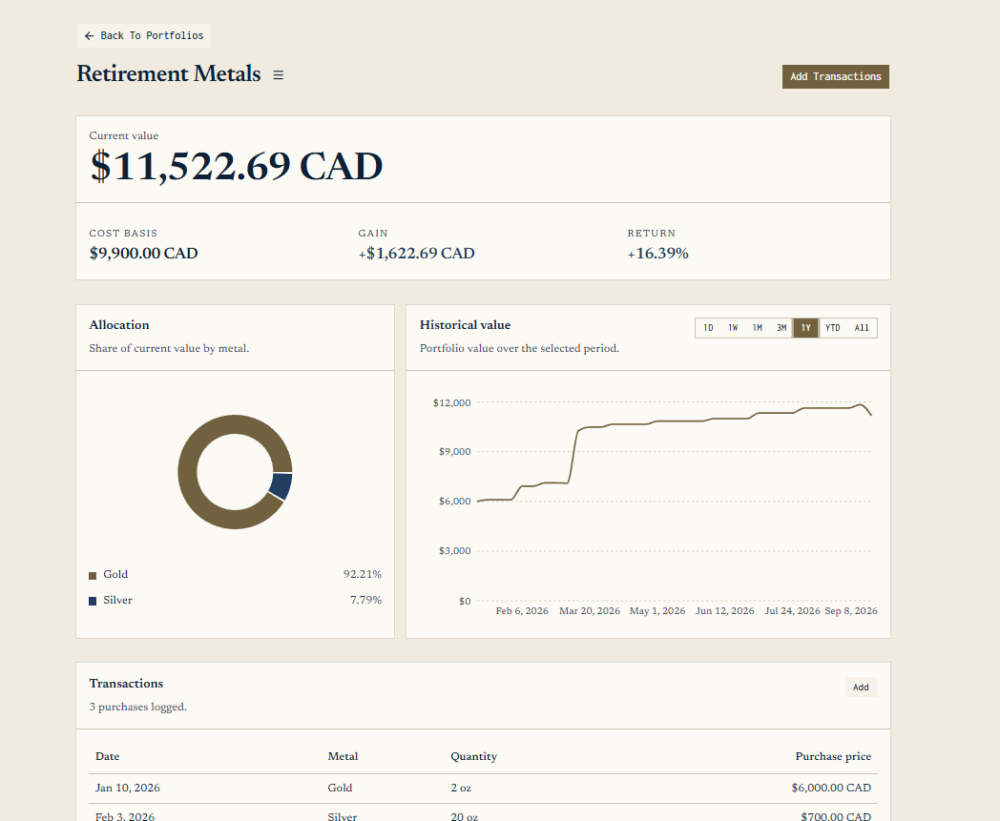

# Precious Metals Portfolio

A local hobby app for tracking purchases of precious metals (Gold, Silver, etc) and seeing how a portfolio's value changes over time.



## Table of Contents

- [Table of Contents](#table-of-contents)
- [Summary](#summary)
- [Features](#features)
- [Run it](#run-it)

## Summary

Register or sign in (session cookie + CSRF), create a CAD portfolio, and log purchases. Holdings, cost basis, unrealized gain/loss, metal allocation, and a historical value series are derived from those transactions plus market prices fetched and persisted on a configurable schedule. Transactions are the portfolio input.

**Stack:** React & TypeScript frontend, Spring Boot & Spring Security API, PostgreSQL, Redis. Market prices can come from a mock provider so nothing external is required. Tests cover the money math (JUnit / Testcontainers).

## Features

- Authentication
- Create/delete a portfolio
- Add a purchase: metal, quantity (oz or grams), price, date
- See transaction history
- See portfolio metrics calculated on BE
- See historical portfolio value
- BE Automatically fetches and persists market prices on a configurable schedule (from mock server API)
- Redis caches expensive portfolio valuation calculations with a configurable TTL

The API covers auth, portfolios, transactions, current value, and history. The UI is login/register plus the three portfolio screens.

## Run it

Docker and Compose are used.

```bash
cp .env.example .env
docker compose up --build
```

- UI: http://localhost:5173
- API: http://localhost:8080
- Mock market API: http://localhost:8090
- Postgres: localhost:5432 (`precious_metals`)
- Redis: localhost:6379

Data lives in a Compose volume.
